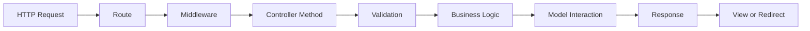

## Overview

Controllers in Dashboard Laravel handle incoming HTTP requests, process business logic, and return responses. They act as the intermediary between routes and models, following the MVC pattern.

<Note>
  All controllers are located in `app/Http/Controllers/` and extend the base `Controller` class.
</Note>

## Controller Architecture

The application follows Laravel 11's controller structure:

```
app/Http/Controllers/
├── Controller.php          # Abstract base controller
├── AuthController.php      # Authentication logic
└── HomeController.php      # Home page controller
```

<CardGroup cols={3}>
  <Card title="Base Controller" icon="layer-group">
    Abstract foundation for all controllers
  </Card>
  <Card title="AuthController" icon="lock">
    Handles login, registration, and logout
  </Card>
  <Card title="HomeController" icon="home">
    Dashboard home page logic
  </Card>
</CardGroup>

## Base Controller

Location: `app/Http/Controllers/Controller.php`

```php
abstract class Controller
{
    //
}
```

<Accordion title="Base Controller Details">
  **Purpose:** Provides common functionality for all application controllers.
  
  **Key Features:**
  - Abstract class that cannot be instantiated directly
  - Extends Laravel's base controller functionality
  - Serves as foundation for dependency injection
  - Can include shared helper methods
  
  **Usage:**
  ```php
  class YourController extends Controller
  {
      // Your controller methods
  }
  ```
</Accordion>

## AuthController

Location: `app/Http/Controllers/AuthController.php`

Handles all authentication-related operations including login, registration, and logout.

```php
class AuthController extends Controller
{
    public function showLogin()
    public function login(Request $request)
    public function showRegister()
    public function register(Request $request)
    public function logout(Request $request)
}
```

### AuthController Methods

<Accordion title="showLogin() - Display Login Page">
  **Route:** `GET /`
  
  **Purpose:** Display the login form or redirect authenticated users to dashboard.
  
  ```php
  public function showLogin()
  {
      if (Auth::check()) return redirect('/dashboard');
      return view('home');
  }
  ```
  
  **Logic:**
  1. Check if user is already authenticated using `Auth::check()`
  2. If authenticated, redirect to `/dashboard`
  3. If not authenticated, display `home.blade.php` view (login page)
  
  **Returns:** View or redirect response
</Accordion>

<Accordion title="login(Request) - Process Login">
  **Route:** `POST /login`
  
  **Purpose:** Validate credentials and authenticate user.
  
  ```php
  public function login(Request $request)
  {
      $request->validate([
          'email'    => 'required|email',
          'password' => 'required|min:6',
      ], [
          'email.required'    => 'El correo es obligatorio.',
          'email.email'       => 'Ingresa un correo válido.',
          'password.required' => 'La contraseña es obligatoria.',
          'password.min'      => 'Mínimo 6 caracteres.',
      ]);

      if (Auth::attempt($request->only('email', 'password'), $request->has('remember'))) {
          $request->session()->regenerate();
          return redirect('/dashboard');
      }

      return back()->withErrors(['email' => 'Credenciales incorrectas.'])->withInput();
  }
  ```
  
  **Validation Rules:**
  - `email` - Required, must be valid email format
  - `password` - Required, minimum 6 characters
  
  **Logic Flow:**
  1. Validate incoming request data
  2. Attempt authentication with `Auth::attempt()`
  3. Check "remember me" checkbox status
  4. On success: Regenerate session and redirect to dashboard
  5. On failure: Redirect back with error message and preserve input
  
  **Security Features:**
  - Session regeneration prevents session fixation attacks
  - Custom Spanish error messages for better UX
  - Remember me functionality for persistent sessions
  
  **Returns:** Redirect response
</Accordion>

<Accordion title="showRegister() - Display Registration Page">
  **Route:** `GET /signup`
  
  **Purpose:** Display the registration form or redirect authenticated users.
  
  ```php
  public function showRegister()
  {
      if (Auth::check()) return redirect('/dashboard');
      return view('signup');
  }
  ```
  
  **Logic:**
  1. Check authentication status
  2. Redirect authenticated users to dashboard
  3. Show `signup.blade.php` for guests
  
  **Returns:** View or redirect response
</Accordion>

<Accordion title="register(Request) - Process Registration">
  **Route:** `POST /signup`
  
  **Purpose:** Create new user account and auto-login.
  
  ```php
  public function register(Request $request)
  {
      $request->validate([
          'name'     => 'required|string|max:255',
          'email'    => 'required|email|unique:users,email',
          'password' => 'required|min:6|confirmed',
      ], [
          'name.required'      => 'El nombre es obligatorio.',
          'email.required'     => 'El correo es obligatorio.',
          'email.unique'       => 'Este correo ya está registrado.',
          'password.min'       => 'Mínimo 6 caracteres.',
          'password.confirmed' => 'Las contraseñas no coinciden.',
      ]);

      $user = User::create([
          'name'     => $request->name,
          'email'    => $request->email,
          'password' => Hash::make($request->password),
      ]);

      Auth::login($user);
      return redirect('/dashboard');
  }
  ```
  
  **Validation Rules:**
  - `name` - Required, string, max 255 characters
  - `email` - Required, valid email, unique in users table
  - `password` - Required, min 6 characters, must match confirmation
  
  **Logic Flow:**
  1. Validate registration data
  2. Create new User record with hashed password
  3. Automatically login the new user
  4. Redirect to dashboard
  
  **Security Features:**
  - Password hashing with `Hash::make()`
  - Email uniqueness check prevents duplicates
  - Password confirmation validation
  - Custom Spanish error messages
  
  **Returns:** Redirect response to dashboard
</Accordion>

<Accordion title="logout(Request) - Process Logout">
  **Route:** `POST /logout`
  
  **Purpose:** End user session and clear authentication.
  
  ```php
  public function logout(Request $request)
  {
      Auth::logout();
      $request->session()->invalidate();
      $request->session()->regenerateToken();
      return redirect('/');
  }
  ```
  
  **Logic Flow:**
  1. Logout user with `Auth::logout()`
  2. Invalidate current session
  3. Regenerate CSRF token for security
  4. Redirect to home page
  
  **Security Features:**
  - Complete session invalidation
  - CSRF token regeneration prevents token reuse
  - Clean logout prevents session hijacking
  
  **Returns:** Redirect to home page
</Accordion>

## HomeController

Location: `app/Http/Controllers/HomeController.php`

```php
class HomeController extends Controller
{
    //
}
```

<Accordion title="HomeController Details">
  **Purpose:** Placeholder for home page logic.
  
  Currently empty - logic is handled directly in routes using closures:
  
  ```php
  Route::get('/dashboard', fn() => view('welcome'));
  ```
  
  **Future Use Cases:**
  - Dashboard data aggregation
  - Statistics calculation
  - Recent activity fetching
  - User preferences loading
</Accordion>

## Request Handling Flow

Understanding how requests flow through controllers:



## Request Validation

Controllers use Laravel's validation system for data integrity:

### Validation Syntax

```php
$request->validate([
    'field' => 'rule1|rule2|rule3',
], [
    'field.rule1' => 'Custom error message',
]);
```

### Common Validation Rules Used

<CardGroup cols={2}>
  <Card title="required" icon="asterisk">
    Field must be present and not empty
  </Card>
  <Card title="email" icon="envelope">
    Must be valid email format
  </Card>
  <Card title="min:6" icon="ruler">
    Minimum length of 6 characters
  </Card>
  <Card title="unique:table,column" icon="check">
    Value must be unique in database
  </Card>
  <Card title="confirmed" icon="copy">
    Must match field_confirmation input
  </Card>
  <Card title="string" icon="font">
    Must be a string data type
  </Card>
  <Card title="max:255" icon="ruler-horizontal">
    Maximum length of 255 characters
  </Card>
</CardGroup>

### Custom Error Messages

The application uses Spanish error messages for better user experience:

```php
[
    'email.required'    => 'El correo es obligatorio.',
    'email.email'       => 'Ingresa un correo válido.',
    'password.required' => 'La contraseña es obligatoria.',
    'password.min'      => 'Mínimo 6 caracteres.',
]
```

## Response Handling

Controllers can return various response types:

<Accordion title="View Responses">
  Return a rendered Blade view:
  
  ```php
  return view('home');
  return view('signup');
  return view('welcome');
  ```
  
  Views are located in `resources/views/`.
</Accordion>

<Accordion title="Redirect Responses">
  Redirect to another URL:
  
  ```php
  return redirect('/dashboard');
  return redirect('/');
  return back(); // Return to previous page
  ```
</Accordion>

<Accordion title="Redirect with Data">
  Pass data to the redirected page:
  
  ```php
  return back()->withErrors(['email' => 'Credenciales incorrectas.']);
  return back()->withInput();
  return redirect('/')->with('success', 'Mensaje de éxito');
  ```
</Accordion>

## Dependency Injection

Controllers use dependency injection for accessing services:

```php
use Illuminate\Http\Request;
use Illuminate\Support\Facades\Auth;
use App\Models\User;
use Illuminate\Support\Facades\Hash;
```

### Injected Dependencies

- **Request** - Access HTTP request data
- **Auth** - Authentication services
- **Hash** - Password hashing
- **User Model** - Database operations

## Route-Controller Mapping

From `routes/web.php`:

```php
Route::get('/',        [AuthController::class, 'showLogin'])->name('home');
Route::post('/login',  [AuthController::class, 'login'])->name('login');
Route::post('/logout', [AuthController::class, 'logout'])->name('logout');
Route::get('/signup',  [AuthController::class, 'showRegister'])->name('signup');
Route::post('/signup', [AuthController::class, 'register'])->name('register');
```

<Note>
  Named routes allow easy URL generation in views using `route('name')`
</Note>

## Closure-Based Routes

Some routes use closures instead of controllers:

```php
Route::get('/dashboard',     fn() => view('welcome'))->name('dashboard');
Route::get('/estadisticas',  fn() => view('estadisticas'))->name('estadisticas');
Route::get('/ventas',        fn() => view('ventas'))->name('ventas');
Route::get('/clientes',      fn() => view('clientes'))->name('clientes');
// ... additional routes
```

**When to use closures:**
- Simple view rendering without logic
- Quick prototyping
- Static pages

**When to use controllers:**
- Complex business logic
- Database operations
- Form processing
- Multiple related actions

## Best Practices

<CardGroup cols={2}>
  <Card title="Single Responsibility" icon="bullseye">
    Each controller method should handle one specific action
  </Card>
  <Card title="Validation" icon="shield-check">
    Always validate user input before processing
  </Card>
  <Card title="Session Security" icon="lock">
    Regenerate sessions after authentication state changes
  </Card>
  <Card title="Error Handling" icon="exclamation-triangle">
    Provide clear, user-friendly error messages
  </Card>
  <Card title="Type Hinting" icon="code">
    Use type hints for better IDE support and error prevention
  </Card>
  <Card title="Named Routes" icon="tag">
    Use named routes for maintainable URL generation
  </Card>
</CardGroup>

## Next Steps

<CardGroup cols={3}>
  <Card title="Views" icon="eye" href="/development/views">
    Learn about Blade templating
  </Card>
  <Card title="Models" icon="database" href="/development/models">
    Explore Eloquent models
  </Card>
  <Card title="Routing" icon="route" href="/api/routes/web-routes">
    Understand route configuration
  </Card>
</CardGroup>