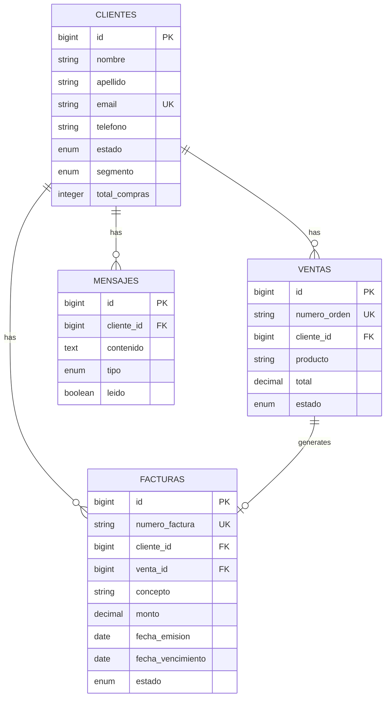

## Schema Overview

Dashboard Laravel uses a relational database structure with the following core tables:

- **users** - Authentication and user management
- **clientes** - Customer/client records
- **ventas** - Sales transactions
- **facturas** - Invoice management
- **mensajes** - Client messaging system
- **estadisticas** - Analytics and statistics
- **homes** - Homepage content
- **nosotros** - About us information

## Table Definitions

### users

Manages authenticated users of the dashboard system.

<ResponseField name="id" type="bigint" required>
  Primary key, auto-incrementing
</ResponseField>

<ResponseField name="name" type="string">
  User's full name
</ResponseField>

<ResponseField name="email" type="string">
  User's email address (unique)
</ResponseField>

<ResponseField name="email_verified_at" type="timestamp">
  Email verification timestamp (nullable)
</ResponseField>

<ResponseField name="password" type="string">
  Hashed password
</ResponseField>

<ResponseField name="remember_token" type="string">
  Token for "remember me" functionality
</ResponseField>

<ResponseField name="created_at" type="timestamp">
  Record creation timestamp
</ResponseField>

<ResponseField name="updated_at" type="timestamp">
  Record last update timestamp
</ResponseField>

**Indexes:**
- UNIQUE on `email`

---

### clientes

Stores customer/client information with segmentation.

<ResponseField name="id" type="bigint" required>
  Primary key, auto-incrementing
</ResponseField>

<ResponseField name="nombre" type="string">
  Client's first name
</ResponseField>

<ResponseField name="apellido" type="string">
  Client's last name
</ResponseField>

<ResponseField name="email" type="string">
  Client's email address (unique)
</ResponseField>

<ResponseField name="telefono" type="string">
  Phone number (nullable)
</ResponseField>

<ResponseField name="estado" type="enum">
  Client status: `activo`, `inactivo` (default: `activo`)
</ResponseField>

<ResponseField name="segmento" type="enum">
  Client segment: `premium`, `regular`, `ocasional` (default: `regular`)
</ResponseField>

<ResponseField name="total_compras" type="integer">
  Total number of purchases (default: 0)
</ResponseField>

<ResponseField name="created_at" type="timestamp">
  Record creation timestamp
</ResponseField>

<ResponseField name="updated_at" type="timestamp">
  Record last update timestamp
</ResponseField>

**Indexes:**
- UNIQUE on `email`

**Relationships:**
- Has many `ventas`
- Has many `facturas`
- Has many `mensajes`

---

### ventas

Records sales transactions linked to clients.

<ResponseField name="id" type="bigint" required>
  Primary key, auto-incrementing
</ResponseField>

<ResponseField name="numero_orden" type="string">
  Unique order number
</ResponseField>

<ResponseField name="cliente_id" type="bigint">
  Foreign key to clientes table
</ResponseField>

<ResponseField name="producto" type="string">
  Product name or description
</ResponseField>

<ResponseField name="total" type="decimal(10,2)">
  Total sale amount
</ResponseField>

<ResponseField name="estado" type="enum">
  Sale status: `completado`, `pendiente`, `en_camino`, `devuelto` (default: `pendiente`)
</ResponseField>

<ResponseField name="created_at" type="timestamp">
  Record creation timestamp
</ResponseField>

<ResponseField name="updated_at" type="timestamp">
  Record last update timestamp
</ResponseField>

**Indexes:**
- UNIQUE on `numero_orden`
- FOREIGN KEY on `cliente_id` references `clientes(id)` ON DELETE CASCADE

**Relationships:**
- Belongs to `cliente`
- Has one `factura`

---

### facturas

Manages invoices for clients and sales.

<ResponseField name="id" type="bigint" required>
  Primary key, auto-incrementing
</ResponseField>

<ResponseField name="numero_factura" type="string">
  Unique invoice number
</ResponseField>

<ResponseField name="cliente_id" type="bigint">
  Foreign key to clientes table
</ResponseField>

<ResponseField name="venta_id" type="bigint">
  Foreign key to ventas table (nullable)
</ResponseField>

<ResponseField name="concepto" type="string">
  Invoice concept or description
</ResponseField>

<ResponseField name="monto" type="decimal(10,2)">
  Invoice amount
</ResponseField>

<ResponseField name="fecha_emision" type="date">
  Issue date
</ResponseField>

<ResponseField name="fecha_vencimiento" type="date">
  Due date
</ResponseField>

<ResponseField name="estado" type="enum">
  Invoice status: `pagada`, `pendiente`, `vencida` (default: `pendiente`)
</ResponseField>

<ResponseField name="created_at" type="timestamp">
  Record creation timestamp
</ResponseField>

<ResponseField name="updated_at" type="timestamp">
  Record last update timestamp
</ResponseField>

**Indexes:**
- UNIQUE on `numero_factura`
- FOREIGN KEY on `cliente_id` references `clientes(id)` ON DELETE CASCADE
- FOREIGN KEY on `venta_id` references `ventas(id)` ON DELETE SET NULL

**Relationships:**
- Belongs to `cliente`
- Belongs to `venta`

---

### mensajes

Manages messages between the system and clients.

<ResponseField name="id" type="bigint" required>
  Primary key, auto-incrementing
</ResponseField>

<ResponseField name="cliente_id" type="bigint">
  Foreign key to clientes table
</ResponseField>

<ResponseField name="contenido" type="text">
  Message content
</ResponseField>

<ResponseField name="tipo" type="enum">
  Message type: `enviado`, `recibido` (default: `recibido`)
</ResponseField>

<ResponseField name="leido" type="boolean">
  Read status (default: false)
</ResponseField>

<ResponseField name="created_at" type="timestamp">
  Record creation timestamp
</ResponseField>

<ResponseField name="updated_at" type="timestamp">
  Record last update timestamp
</ResponseField>

**Indexes:**
- FOREIGN KEY on `cliente_id` references `clientes(id)` ON DELETE CASCADE

**Relationships:**
- Belongs to `cliente`

---

### estadisticas

Stores sales statistics and analytics data.

<ResponseField name="id" type="bigint" required>
  Primary key, auto-incrementing
</ResponseField>

<ResponseField name="producto" type="string">
  Product name
</ResponseField>

<ResponseField name="cantidad" type="integer">
  Quantity sold
</ResponseField>

<ResponseField name="precio" type="decimal(10,2)">
  Unit price
</ResponseField>

<ResponseField name="fecha" type="date">
  Statistics date
</ResponseField>

<ResponseField name="total_ventas" type="decimal(12,2)">
  Total sales amount
</ResponseField>

<ResponseField name="margen" type="decimal(8,2)">
  Profit margin
</ResponseField>

<ResponseField name="categoria" type="string">
  Product category (default: `general`)
</ResponseField>

<ResponseField name="estado" type="string">
  Status (default: `activo`)
</ResponseField>

<ResponseField name="created_at" type="timestamp">
  Record creation timestamp
</ResponseField>

<ResponseField name="updated_at" type="timestamp">
  Record last update timestamp
</ResponseField>

---

### homes

Manages homepage content and configuration.

<ResponseField name="id" type="bigint" required>
  Primary key, auto-incrementing
</ResponseField>

<ResponseField name="created_at" type="timestamp">
  Record creation timestamp
</ResponseField>

<ResponseField name="updated_at" type="timestamp">
  Record last update timestamp
</ResponseField>

---

### nosotros

Stores "About Us" page content.

<ResponseField name="id" type="bigint" required>
  Primary key, auto-incrementing
</ResponseField>

<ResponseField name="created_at" type="timestamp">
  Record creation timestamp
</ResponseField>

<ResponseField name="updated_at" type="timestamp">
  Record last update timestamp
</ResponseField>

---

## Entity Relationship Diagram



## Migration Files Reference

All schema definitions are created through migration files located in:

```
database/migrations/
├── 0001_01_01_000000_create_users_table.php
├── 0001_01_01_000001_create_cache_table.php
├── 0001_01_01_000002_create_jobs_table.php
├── 2026_03_03_021430_create_homes_table.php
├── 2026_03_03_022050_create_estadisticas_table.php
├── 2026_03_03_191644_create_clientes_table.php
├── 2026_03_03_191659_create_ventas_table.php
├── 2026_03_03_191710_create_facturas_table.php
├── 2026_03_03_191720_create_mensajes_table.php
└── 2026_03_04_014709_create_nosotros_table.php
```
