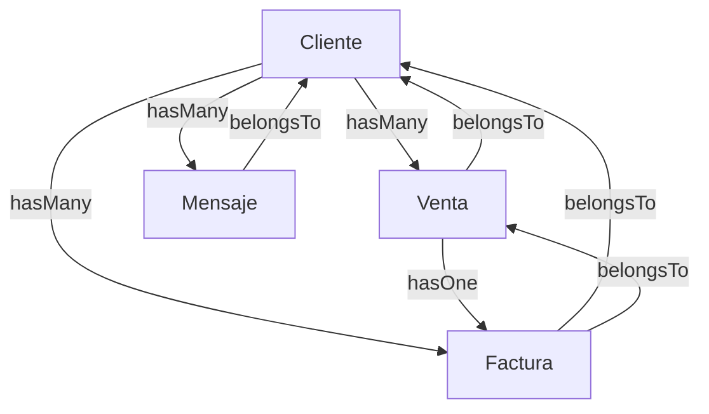

## Overview

Dashboard Laravel uses **Eloquent ORM**, Laravel's powerful database abstraction layer. Models represent database tables and define relationships between entities.

<Note>
  All models are located in `app/Models/` and extend `Illuminate\Database\Eloquent\Model`
</Note>

## Core Models

The application includes 7 primary models representing the business domain:

<CardGroup cols={2}>
  <Card title="User" icon="user">
    Authentication and user management
  </Card>
  <Card title="Cliente" icon="users">
    Customer/client records with relationships
  </Card>
  <Card title="Venta" icon="shopping-cart">
    Sales transactions and orders
  </Card>
  <Card title="Factura" icon="file-invoice-dollar">
    Invoice generation and tracking
  </Card>
  <Card title="Mensaje" icon="envelope">
    Messaging system
  </Card>
  <Card title="Nosotros" icon="info-circle">
    About/company information
  </Card>
  <Card title="Home & Estadisticas" icon="chart-bar">
    Dashboard statistics
  </Card>
</CardGroup>

## User Model

Location: `app/Models/User.php`

Handles user authentication and authorization.

```php
class User extends Authenticatable
{
    use HasFactory, Notifiable;

    protected $fillable = [
        'name',
        'email',
        'password',
    ];

    protected $hidden = [
        'password',
        'remember_token',
    ];

    protected function casts(): array
    {
        return [
            'email_verified_at' => 'datetime',
            'password' => 'hashed',
        ];
    }
}
```

<Accordion title="User Model Details">
  **Extends:** `Illuminate\Foundation\Auth\User as Authenticatable`
  
  **Traits:**
  - `HasFactory` - Enables model factories for testing
  - `Notifiable` - Adds notification capabilities
  
  **Fillable Attributes:**
  - `name` - User's full name
  - `email` - User's email address
  - `password` - Hashed password
  
  **Hidden Attributes:**
  - `password` - Never exposed in JSON responses
  - `remember_token` - Session persistence token
  
  **Casts:**
  - `email_verified_at` - Automatically cast to DateTime
  - `password` - Automatically hashed on save
  
  **Timestamps:** Enabled (created_at, updated_at)
</Accordion>

## Cliente Model

Location: `app/Models/Cliente.php`

Represents customers/clients with full relationship mapping.

```php
class Cliente extends Model
{
    use HasFactory;

    protected $fillable = [
        'nombre',
        'apellido',
        'email',
        'telefono',
        'estado',
        'segmento',
        'total_compras',
    ];

    public function ventas()
    {
        return $this->hasMany(Venta::class);
    }

    public function facturas()
    {
        return $this->hasMany(Factura::class);
    }

    public function mensajes()
    {
        return $this->hasMany(Mensaje::class);
    }
}
```

<Accordion title="Cliente Model Details">
  **Table:** `clientes`
  
  **Fillable Attributes:**
  - `nombre` - First name
  - `apellido` - Last name
  - `email` - Contact email
  - `telefono` - Phone number
  - `estado` - Client status (active/inactive)
  - `segmento` - Customer segment
  - `total_compras` - Total purchase amount
  
  **Relationships:**
  - `hasMany(Venta::class)` - One client has many sales
  - `hasMany(Factura::class)` - One client has many invoices
  - `hasMany(Mensaje::class)` - One client has many messages
  
  **Timestamps:** Enabled
</Accordion>

## Venta Model

Location: `app/Models/Venta.php`

Tracks sales transactions and order information.

```php
class Venta extends Model
{
    use HasFactory;

    protected $fillable = [
        'numero_orden',
        'cliente_id',
        'producto',
        'total',
        'estado',
    ];

    public function cliente()
    {
        return $this->belongsTo(Cliente::class);
    }

    public function factura()
    {
        return $this->hasOne(Factura::class);
    }
}
```

<Accordion title="Venta Model Details">
  **Table:** `ventas`
  
  **Fillable Attributes:**
  - `numero_orden` - Unique order number
  - `cliente_id` - Foreign key to Cliente
  - `producto` - Product/service description
  - `total` - Sale total amount
  - `estado` - Order status (pending/completed/cancelled)
  
  **Relationships:**
  - `belongsTo(Cliente::class)` - Each sale belongs to one client
  - `hasOne(Factura::class)` - Each sale has one invoice
  
  **Timestamps:** Enabled
</Accordion>

## Factura Model

Location: `app/Models/Factura.php`

Manages invoice generation and payment tracking.

```php
class Factura extends Model
{
    use HasFactory;

    protected $fillable = [
        'numero_factura',
        'cliente_id',
        'venta_id',
        'concepto',
        'monto',
        'fecha_emision',
        'fecha_vencimiento',
        'estado',
    ];

    protected $casts = [
        'fecha_emision'     => 'date',
        'fecha_vencimiento' => 'date',
    ];

    public function cliente()
    {
        return $this->belongsTo(Cliente::class);
    }

    public function venta()
    {
        return $this->belongsTo(Venta::class);
    }
}
```

<Accordion title="Factura Model Details">
  **Table:** `facturas`
  
  **Fillable Attributes:**
  - `numero_factura` - Invoice number
  - `cliente_id` - Foreign key to Cliente
  - `venta_id` - Foreign key to Venta
  - `concepto` - Invoice description/concept
  - `monto` - Invoice amount
  - `fecha_emision` - Issue date
  - `fecha_vencimiento` - Due date
  - `estado` - Payment status (paid/pending/overdue)
  
  **Casts:**
  - `fecha_emision` - Cast to Carbon date instance
  - `fecha_vencimiento` - Cast to Carbon date instance
  
  **Relationships:**
  - `belongsTo(Cliente::class)` - Invoice belongs to client
  - `belongsTo(Venta::class)` - Invoice belongs to sale
  
  **Timestamps:** Enabled
</Accordion>

## Mensaje Model

Location: `app/Models/Mensaje.php`

Handles customer messages and communications.

```php
class Mensaje extends Model
{
    use HasFactory;

    protected $fillable = [
        'cliente_id',
        'contenido',
        'tipo',
        'leido',
    ];

    protected $casts = [
        'leido' => 'boolean',
    ];

    public function cliente()
    {
        return $this->belongsTo(Cliente::class);
    }
}
```

<Accordion title="Mensaje Model Details">
  **Table:** `mensajes`
  
  **Fillable Attributes:**
  - `cliente_id` - Foreign key to Cliente
  - `contenido` - Message content/body
  - `tipo` - Message type (inquiry/support/feedback)
  - `leido` - Read status
  
  **Casts:**
  - `leido` - Cast to boolean (true/false)
  
  **Relationships:**
  - `belongsTo(Cliente::class)` - Message belongs to client
  
  **Timestamps:** Enabled
</Accordion>

## Additional Models

<Accordion title="Nosotros Model">
  Location: `app/Models/Nosotros.php`
  
  ```php
  class Nosotros extends Model
  {
      //
  }
  ```
  
  Basic model for storing "About Us" company information. Uses default Eloquent behavior with timestamps enabled.
</Accordion>

<Accordion title="Home & Estadisticas Models">
  Location: `app/Models/home.php` and `app/Models/estadisticas.php`
  
  Support models for dashboard statistics and home page data aggregation.
</Accordion>

## Model Relationships

Understanding the relationship structure:



### Relationship Types

<CardGroup cols={2}>
  <Card title="hasMany" icon="arrow-right">
    One-to-many relationship. Cliente has many Ventas, Facturas, and Mensajes.
  </Card>
  <Card title="belongsTo" icon="arrow-left">
    Inverse of hasMany. Venta/Factura/Mensaje belong to Cliente.
  </Card>
  <Card title="hasOne" icon="link">
    One-to-one relationship. Each Venta has one Factura.
  </Card>
</CardGroup>

## Using Model Relationships

### Accessing Related Data

```php
// Get all sales for a client
$cliente = Cliente::find(1);
$ventas = $cliente->ventas; // Returns collection of Venta models

// Get client from a sale
$venta = Venta::find(1);
$cliente = $venta->cliente; // Returns Cliente model

// Get invoice from sale
$venta = Venta::with('factura')->find(1);
$factura = $venta->factura;

// Eager loading to prevent N+1 queries
$clientes = Cliente::with(['ventas', 'facturas', 'mensajes'])->get();
```

## Mass Assignment Protection

All models use the `$fillable` property for mass assignment protection:

<Note>
  Only attributes listed in `$fillable` can be mass-assigned using `create()` or `update()` methods. This protects against mass assignment vulnerabilities.
</Note>

```php
// This works - all attributes are fillable
Cliente::create([
    'nombre' => 'Juan',
    'apellido' => 'Pérez',
    'email' => 'juan@example.com',
]);

// This would fail - 'id' is not fillable
Cliente::create(['id' => 999]); // Exception thrown
```

## Timestamps

All models automatically track creation and modification times:

- `created_at` - Automatically set when record is created
- `updated_at` - Automatically updated when record is modified

<Note>
  Timestamps are enabled by default. Access them as Carbon instances for easy date manipulation.
</Note>

## Next Steps

<CardGroup cols={2}>
  <Card title="Controllers" icon="code" href="/development/controllers">
    Learn how controllers interact with models
  </Card>
  <Card title="Database Migrations" icon="database" href="/development/database/migrations">
    View database schema definitions
  </Card>
</CardGroup>