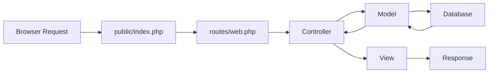

## Overview

Dashboard Laravel is built on Laravel 11, following the Model-View-Controller (MVC) architectural pattern. The project provides a comprehensive administrative dashboard for managing clients, sales, invoices, and messages.

## Directory Structure

The project follows Laravel 11's standard directory organization:

```
source/
├── app/                    # Application core logic
│   ├── Http/
│   │   └── Controllers/    # Request handlers
│   ├── Models/            # Eloquent ORM models
│   └── Providers/         # Service providers
├── bootstrap/             # Framework bootstrap
├── config/                # Configuration files
├── database/
│   ├── factories/         # Model factories
│   ├── migrations/        # Database migrations
│   └── seeders/          # Database seeders
├── public/                # Public assets (CSS, JS, images)
│   ├── css/
│   └── index.php         # Application entry point
├── resources/
│   ├── css/              # Source stylesheets
│   ├── js/               # Source JavaScript
│   └── views/            # Blade templates
│       └── layouts/      # Layout templates
├── routes/                # Route definitions
│   └── web.php           # Web routes
├── storage/               # Generated files and logs
│   ├── app/
│   ├── framework/
│   └── logs/
└── tests/                 # Automated tests
    ├── Feature/
    └── Unit/
```

## Laravel 11 Architecture

<CardGroup cols={2}>
  <Card title="MVC Pattern" icon="layer-group">
    Separates application logic into Models (data), Views (presentation), and Controllers (business logic)
  </Card>
  <Card title="Eloquent ORM" icon="database">
    Database abstraction layer for object-relational mapping and relationships
  </Card>
  <Card title="Blade Templating" icon="file-code">
    Powerful templating engine with inheritance and component support
  </Card>
  <Card title="Routing System" icon="route">
    Clean URL routing with middleware support and named routes
  </Card>
</CardGroup>

## Key Directories

<Accordion title="app/ - Application Core">
  Contains the core application logic:
  
  - **Http/Controllers/** - Handles incoming HTTP requests
    - `AuthController.php` - Authentication logic
    - `Controller.php` - Base controller
    - `HomeController.php` - Home page logic
  
  - **Models/** - Eloquent models representing database tables
    - `User.php` - User authentication model
    - `Cliente.php` - Client management
    - `Venta.php` - Sales records
    - `Factura.php` - Invoice management
    - `Mensaje.php` - Message system
  
  - **Providers/** - Service providers for application bootstrapping
    - `AppServiceProvider.php` - Main service provider
</Accordion>

<Accordion title="resources/ - Frontend Assets">
  Contains views and frontend assets:
  
  - **views/** - Blade templates (13 total files)
    - `layouts/app.blade.php` - Main dashboard layout
    - `layouts/auth.blade.php` - Authentication layout
    - `home.blade.php` - Login page
    - `welcome.blade.php` - Dashboard home
    - `clientes.blade.php` - Client management
    - `ventas.blade.php` - Sales management
    - `facturas.blade.php` - Invoice management
    - `mensajes.blade.php` - Message center
    - Plus 5 additional views
  
  - **css/** - Stylesheet sources
  - **js/** - JavaScript sources
</Accordion>

<Accordion title="routes/ - URL Routing">
  Defines application routes:
  
  ```php
  Route::get('/', [AuthController::class, 'showLogin']);
  Route::post('/login', [AuthController::class, 'login']);
  Route::get('/dashboard', fn() => view('welcome'));
  Route::get('/clientes', fn() => view('clientes'));
  // ... additional routes
  ```
  
  See `routes/web.php` for complete route definitions.
</Accordion>

<Accordion title="database/ - Database Layer">
  Database migrations and seeders:
  
  - **migrations/** - Database schema definitions
    - User tables (authentication)
    - Business tables (clientes, ventas, facturas, mensajes)
    - System tables (cache, jobs)
  
  - **factories/** - Test data factories
  - **seeders/** - Database seeding for development
</Accordion>

<Accordion title="public/ - Web Root">
  Publicly accessible files:
  
  - `index.php` - Application entry point
  - `css/` - Compiled stylesheets
    - `dashboard.css` - Main dashboard styles
  - Assets served directly to browsers
</Accordion>

<Accordion title="config/ - Configuration">
  Framework configuration files:
  
  - `app.php` - Application settings
  - `auth.php` - Authentication configuration
  - `database.php` - Database connections
  - `session.php` - Session management
  - Plus additional configuration files
</Accordion>

## File Organization Best Practices

<Note>
  The project follows Laravel 11 conventions for maximum maintainability and team collaboration.
</Note>

### Controllers
Location: `app/Http/Controllers/`
- One controller per resource or feature area
- Named with descriptive names ending in `Controller`
- Extend the base `Controller` class

### Models  
Location: `app/Models/`
- One model per database table
- Singular, capitalized naming (e.g., `Cliente`, not `Clientes`)
- Define relationships, fillable attributes, and casts

### Views
Location: `resources/views/`
- Organized by feature or section
- Use `.blade.php` extension
- Layouts stored in `layouts/` subdirectory
- Follow naming convention matching route names

### Routes
Location: `routes/web.php`
- Grouped by functionality
- Authentication routes at the top
- Dashboard routes following
- Use named routes for easy reference

## Application Flow



1. Request hits `public/index.php`
2. Routes in `routes/web.php` match URL
3. Controller method handles business logic
4. Model interacts with database via Eloquent
5. View renders response using Blade
6. Response sent back to browser

## Next Steps

<CardGroup cols={3}>
  <Card title="Models" icon="database" href="/development/models">
    Explore Eloquent models and relationships
  </Card>
  <Card title="Controllers" icon="code" href="/development/controllers">
    Learn about controller architecture
  </Card>
  <Card title="Views" icon="eye" href="/development/views">
    Understand Blade templating system
  </Card>
</CardGroup>